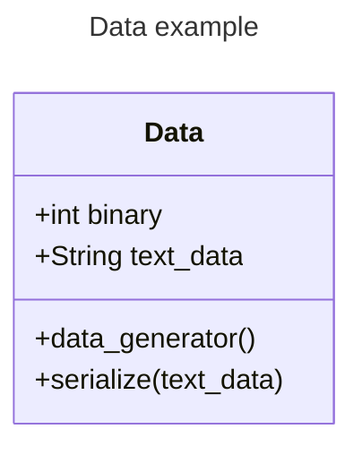
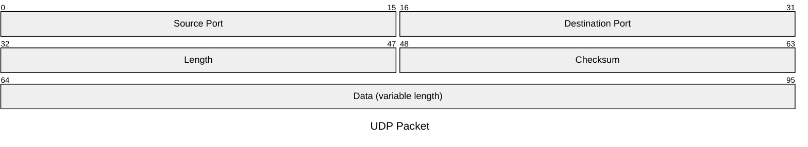
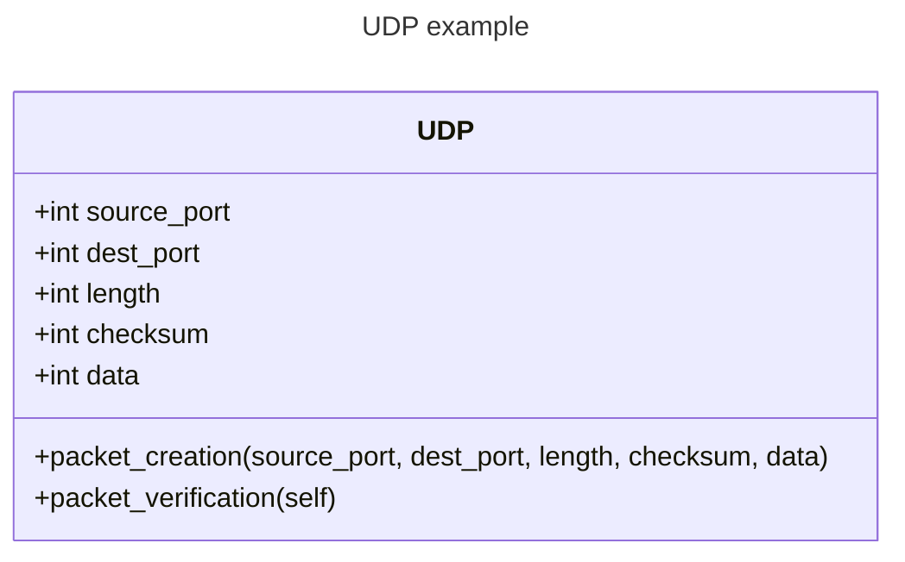
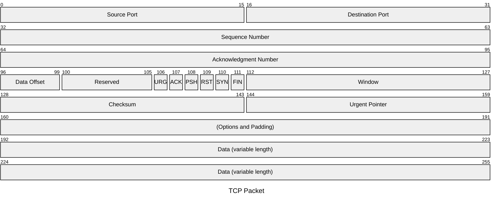

# The Packet Generator

The packet generator feature will start with the data class. The following diagram shows what is expected out of the code creating the data.

This data class will be the parent class to the network packet. The packet will be built in a series of stages, starting with the UDP packet as shown below.

The attributes and methods within the class will be as follows.

We will begin with the UDP packet because it is a simpler network packet than the TCP packet, which has many other headers (and therefore data) included in the packet. You can see this in the TCP packet below.

This will be the first task in the project.

### Directions
1. Accept the task in Github projects in this repository
2. Build the data class, then its relevant child classes (the UDP packet, and the TCP packet).
3. Submit the pull request and I will review it.

If you have any questions let me know. I will be dropping some information in the docs folder and the discord to help you with your research on how to do this.
