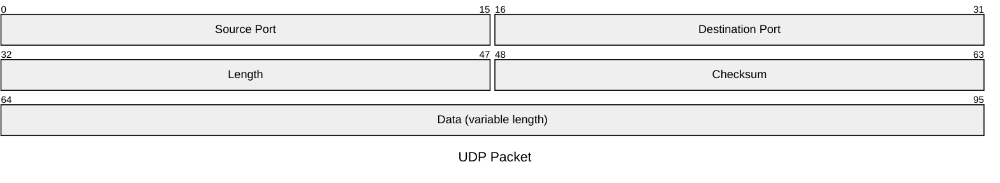
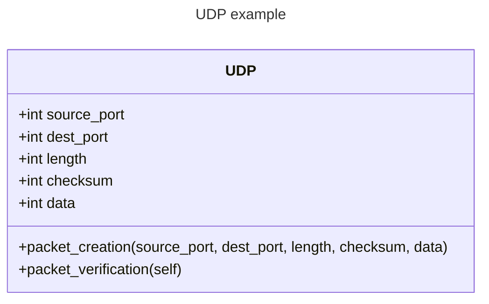
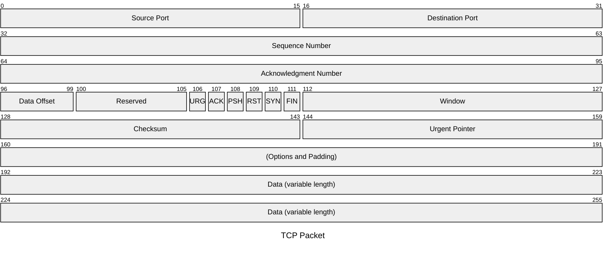

# The Packet Generator

The Packet Generator section of the code will take binary data and create network segments for transfer over a network. 

The first class will be the UDP class, with the TCP class inheriting from that class since they have some of the same fields.

(Originally the data class was going to be the initial class but there are many different types of data that could potentially be transmit. So although we are initially working with text, to future proof the code we are making the packet segments logic separate from identifying any type of data since network segments don't care anyways. Its the job of the protocol to handle that sort of thing, which gets a little bit into the other layers of the OSI model which I'll go over in another file.)

### The Network Packets
This data class will be the parent class to the network packet. The actual network packets will be built in a series of stages, starting with the UDP packet as shown below.

The attributes and methods within the class will be as follows.

One thing to note is this diagram shows the data types as integers but the payload and the rest of the fields will actually be bytes not just integers but we can refer to them as integers, which I'll explain in another file.
We will begin with the UDP packet because it is a simpler network packet than the TCP packet, which has many other headers (and therefore data) included in the packet. You can see this in the TCP packet below.

