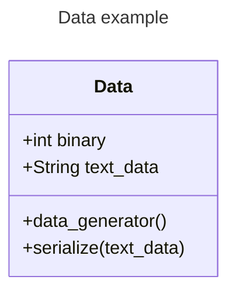
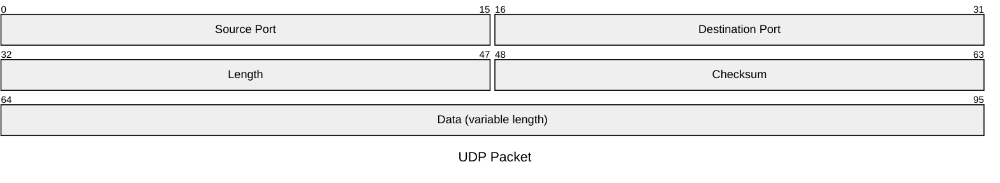
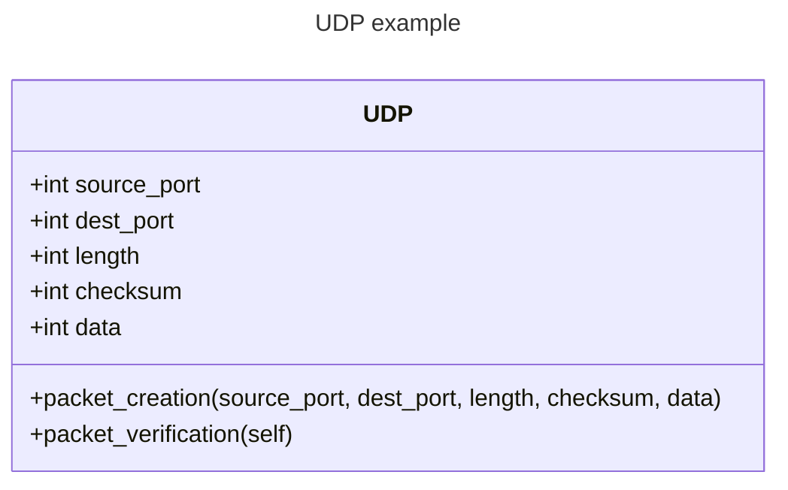
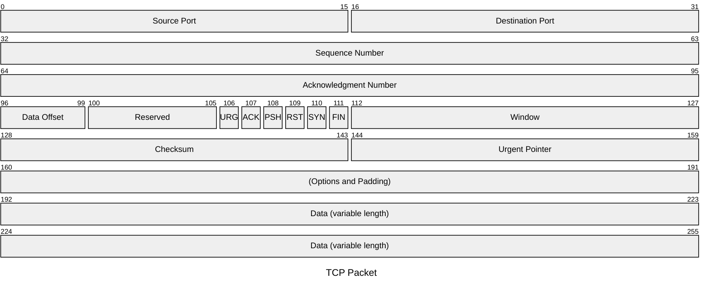

# The Packet Generator

### Expected Outcomes
The packet generator feature will start with the data class. The following diagram shows what is expected out of the code creating the data.

#### Context
Python is an _object oriented programming_ (OOP) language. This means that the programming philosophy revolves around python **objects**.

Python **objects** will typically be made up of two things, **_attributes_** and **_methods_**.

**_Attributes_** describe something about the object in data. For example, a car could be represented as a python object with a few attributes. The name of the **_make_** and **_model_** of the car would both be examples of attributes of the car, represented by the string data type (AKA data that is text).

**_Methods_** describe something that the object can do. If we were building a game and we had this car object, we could say that the car would be able to drive. The drive action would then be a function (or method) the car would be able to do. 

Lets put this into context for the data object. The basic premise of the project is that we will build network packets using python. These network packets represent real pieces of data, whether it's your banking information, videogame packets, or whole entire websites. For simplicity, we'll just be building packets of data that represent text, like what you're reading right now.

You can see in the data object there is the **_text_data_** portion, and that refers to the text that we will be transmitting in the network.

There is also a **_+serialize(text_data)_** method in the diagram as well. This refers to a method the object will be able to use to take the **_text_data_** and convert it to binary. We'll need the object to be able to do this because network packets get transferred in binary form.

This is where the **_+int binary_** attribute comes into play. **_text_data_** is one saved form of data that is a string type. Once it's been converted to binary format, however, it will at that point be a **_number_** (or int) data type, not a string. The **_+int binary_** attribute is just another attribute that will hold the converted binary format. Its up to you how the code actually does these things.

There is one last thing, however. Python revolves around objects. The way that objects are created in the code is through classes, which are like blueprints for objects. A class will say that every car, for example, needs to have a make and model for attributes, and drive as a method. At this point there will be no car, just an idea of what a car would be. The car is actually created by creating an instance of the class. This **_instance_** of the class is the actual object, but in order to create the object you need to feed the class the necessary information for instantiation (i.e. The name of the make and model of the car). So what you're doing is writing a python class that has the ability to generate data.

### The Network Packets
This data class will be the parent class to the network packet. The actual network packets will be built in a series of stages, starting with the UDP packet as shown below.

The attributes and methods within the class will be as follows.

We will begin with the UDP packet because it is a simpler network packet than the TCP packet, which has many other headers (and therefore data) included in the packet. You can see this in the TCP packet below.

This will be the first task in the project.

### Directions
1. Accept the task in Github projects in this repository
2. Build the data class, then its relevant child classes (the UDP packet, and the TCP packet).
3. Submit the pull request and I will review it.

If you have any questions let me know. I will be dropping some information in the docs folder and the discord to help you with your research on how to do this.
